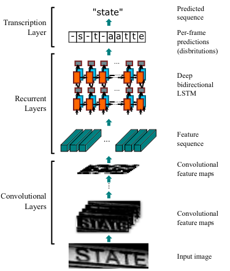

## CRNN for recognizing handwritten text in Vietnamese

This is the implementation for the paper [An End-to-End Trainable Neural Network for Image-based Sequence
Recognition and Its Application to Scene Text Recognition](https://arxiv.org/pdf/1507.05717.pdf). We used this method to evaluate our handwriting image dataset.

Link to the UIT-HWDB dataset: [https://github.com/hieunghia-pat/UIT-HWDB-dataset](https://github.com/hieunghia-pat/UIT-HWDB-dataset)
